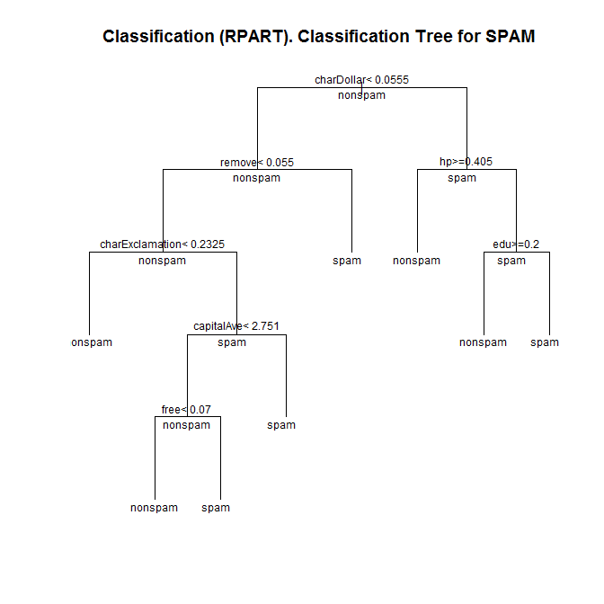
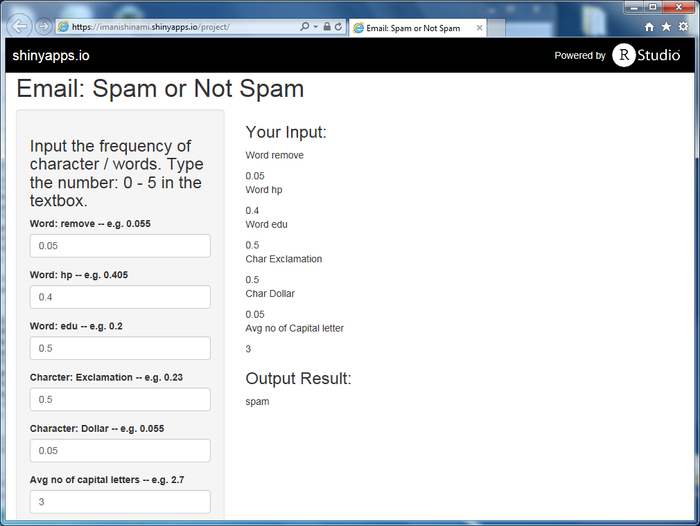

# DDP_project
Project for Developing Data Products

## Introduction
This assignment uses data from Spam E-mail Detabase collected at Hewlett-Packard Labs, that classifies 4601 e-mails as spam or non-spam. In addition to this class label there are 57 variables indicating the frequency of certain words and characters in the e-mail.
This shiny apps allows you to enter the frequency of some variables to predict if the mail is either "nonspam" or "spam".

## Data
The first 48 variables contain the frequency of the variable name (e.g., business) in the e-mail. If the variable name starts with num (e.g., num650) the it indicates the frequency of the corresponding number (e.g., 650). The variables 49-54 indicate the frequency of the characters ‘;’, ‘(’, ‘[’, ‘!’, ‘\$’, and ‘\#’. The variables 55-57 contain the average, longest and total run-length of capital letters. Variable 58 indicates the type of the mail and is either "nonspam" or "spam", i.e. unsolicited commercial e-mail.

## Loading data and Preprocessing
Load the same seed with the following line of code and split data into two sets; one is for the training data and reserved the other for cross-validation. 

```
library(kernlab)
library(lattice)
library(ggplot2)
library(rpart)

data("spam")
index <- 1:nrow(spam)

set.seed(313)

testindex <- sample(index, trunc(length(index)/3))
testset <- spam[testindex,]
trainingset <- spam[-testindex,]
```
I used the classification tree to find what variables can be used to determine the type of email (nonspam or spam).

```
model.rpart <- rpart(type ~ ., method = "class", data = trainingset)
printcp(model.rpart)
```

It shows that 7 variables (capitalAve,charDollar,charExclamation,edu,free,hp,remove) are important.


```
Classification tree:
rpart(formula = type ~ ., data = trainingset, method = "class")

Variables actually used in tree construction:
[1] capitalAve      charDollar      charExclamation edu            
[5] free            hp              remove         

Root node error: 1202/3068 = 0.39179

n= 3068 

        CP nsplit rel error  xerror     xstd
1 0.485857      0   1.00000 1.00000 0.022494
2 0.146423      1   0.51414 0.56406 0.019120
3 0.044093      2   0.36772 0.44592 0.017498
4 0.029950      4   0.27953 0.33777 0.015615
5 0.013311      5   0.24958 0.29285 0.014686
6 0.011647      6   0.23627 0.28619 0.014540
7 0.010000      7   0.22463 0.27038 0.014182
```

```
library(rattle)
plot(model.rpart, uniform = TRUE, main = "Classification (RPART). Classification Tree for SPAM")
text(model.rpart, all = TRUE, cex = 0.75)

```

 

## Predicting with Support Vector Machines model

Produce SVM model using the svm function. The SVM model is 90% accurate on the training data.

```
library(e1071)
model <- svm(type ~ ., data = trainingset, 
method = "C-classification", kernel = "radial", cost = 10, gamma = 0.1)
pred <- predict(model, testset)
library(caret)
confusionMatrix(pred,testset$type)
```
```
Confusion Matrix and Statistics

          Reference
Prediction nonspam spam
   nonspam     889  114
   spam         33  497
                                          
               Accuracy : 0.9041          
                 95% CI : (0.8883, 0.9184)
    No Information Rate : 0.6014          
    P-Value [Acc > NIR] : < 2.2e-16       
                                          
                  Kappa : 0.7954          
 Mcnemar's Test P-Value : 4.159e-11       
                                          
            Sensitivity : 0.9642          
            Specificity : 0.8134          
         Pos Pred Value : 0.8863          
         Neg Pred Value : 0.9377          
             Prevalence : 0.6014          
         Detection Rate : 0.5799          
   Detection Prevalence : 0.6543          
      Balanced Accuracy : 0.8888          
                                          
       'Positive' Class : nonspam         
                                   
```
## Shiny Apps
On the side panel, user can enter frequency of the words / characters. "capitalAve" contains the average length of capital letters.
Upon entering the numbers, the application predict if the email is spam or nonspam

 
